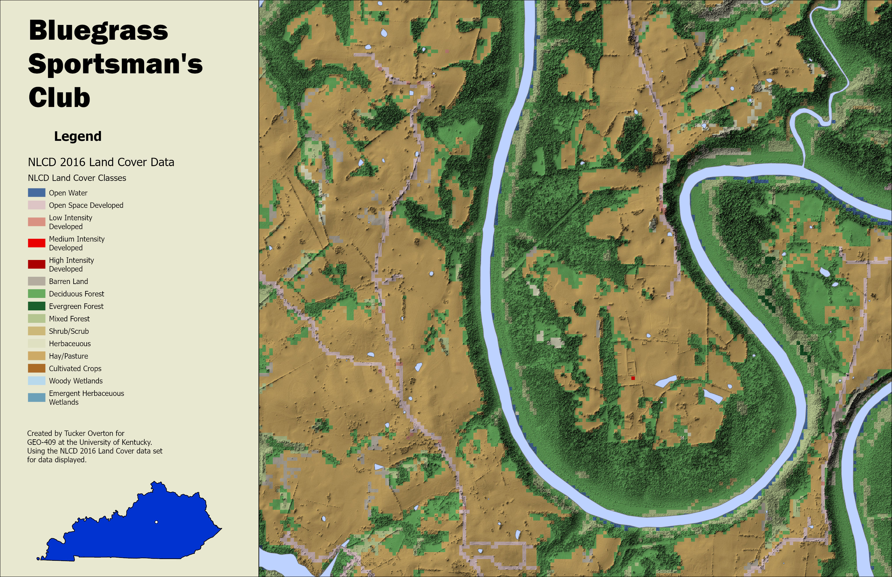

# Hillshade of Bluegrass Sportsmen's Club
## Where this area is located

This area of land in Kentucky is BLuegrass Sportsmen's Club.
It is where I have shot for the University's club shotgun team.
The club is about 15 minutes outside of Willmore and is surrounded,
by the Kentucky River making it an interesting piece of land.

     
*Hillshade of Blue Grass Sportsmen's Club*

[Link to high-resolution version](BGSC_hillshade.pdf)     

Created by Tucker Overton for 
GEO-409 at the University of Kentucky. 
Using the NLCD 2016 Land Cover data set 
for data displayed. Using Arc Gis Pro.